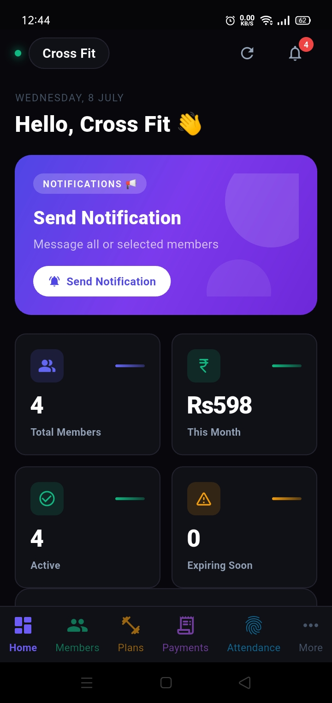
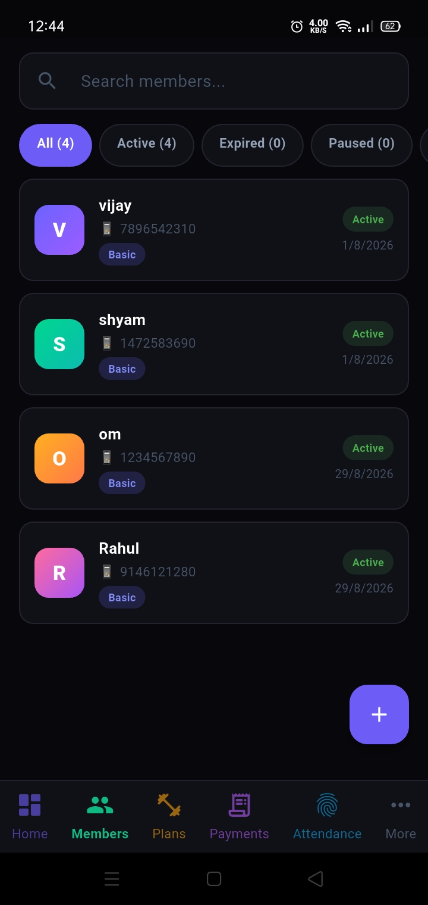
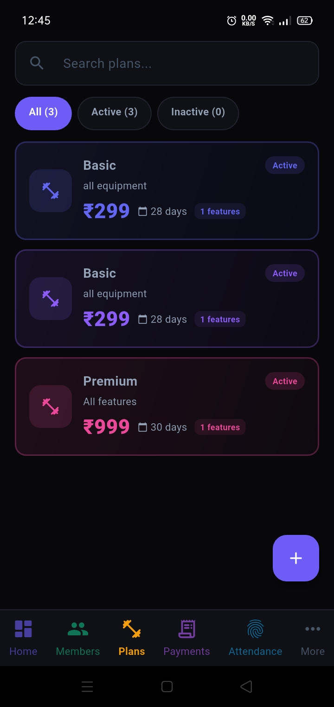
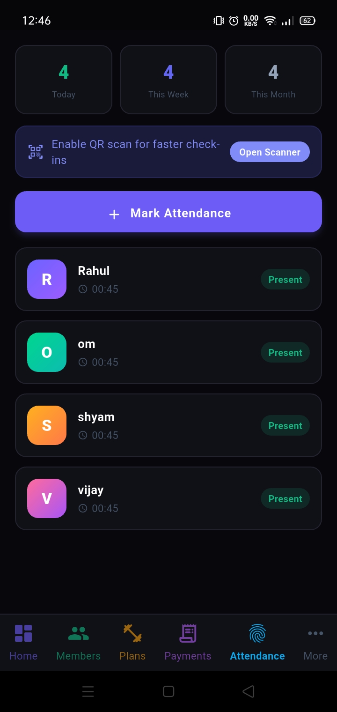
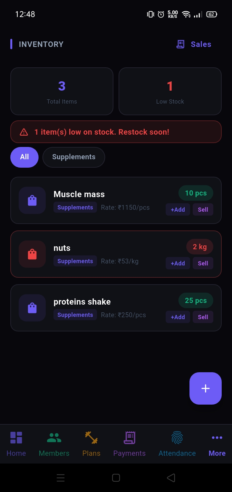
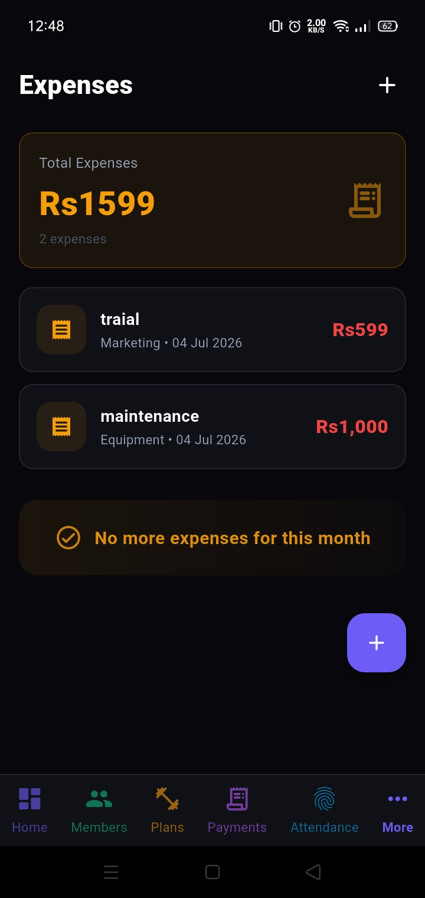
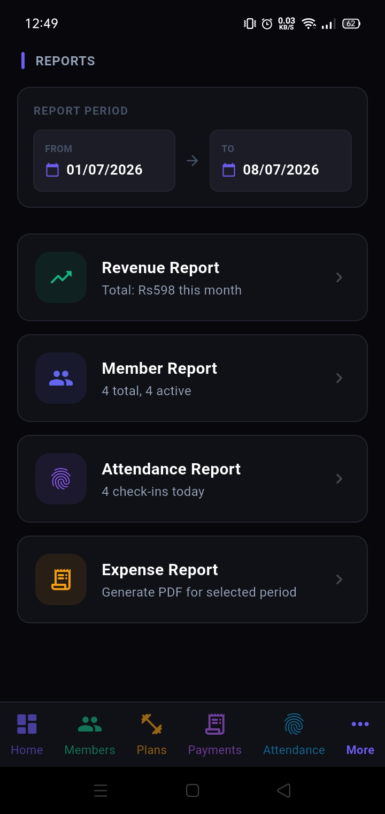
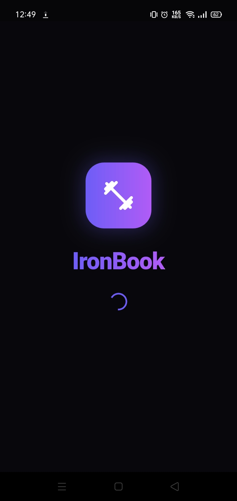

# IronBook

A SaaS Multi-Gym Management App built with Flutter + Supabase.

## Screenshots

<p align="center">
  
  
  
  
  
  
  
  
  
</p>

## Features

- **Member Management** — Add, edit, search, track membership expiry
- **Plans** — Create membership plans with pricing & duration
- **Payments** — Record payments with discounts, multiple methods (Cash/UPI/Card)
- **Attendance** — Check-in/check-out tracking, QR code scanner
- **Staff** — Role-based staff management (owner, admin, trainer, staff)
- **Expenses** — Track gym expenses by category
- **Reports** — Export PDF/CSV/Excel (members, revenue, attendance, expenses)
- **Notifications** — Real-time via Supabase Realtime, in-app alerts
- **Import/Export** — Bulk import members from CSV, export all reports
- **Admin Panel** — Superadmin dashboard for multi-gym management
- **Multi-language** — English, Hindi, Marathi

## Tech Stack

| Layer | Technology |
|-------|-----------|
| Frontend | Flutter (Riverpod, GoRouter) |
| Backend | Supabase (PostgreSQL, Auth, Realtime, Storage) |
| State | Riverpod (StateNotifier + FutureProvider) |
| Routing | GoRouter (auth guards, shell routes) |
| Reports | PDF, Excel, CSV |
| Scanning | Mobile Scanner (QR) |

## Setup

### Prerequisites
- Flutter SDK >= 3.11.4
- Supabase project

### Steps

```bash
git clone https://github.com/your-username/ironbook.git
cd ironbook

cp .env.example .env

# Add your Supabase credentials in .env
SUPABASE_URL=https://your-project.supabase.co
SUPABASE_ANON_KEY=your-anon-key-here

flutter pub get
flutter run
```

Run `supabase_schema.sql` then `supabase_migration.sql` in Supabase SQL Editor.

## Project Structure

```
lib/
├── core/           # Constants, router, services, theme, utils
├── models/         # Data models (member, plan, payment, etc.)
├── providers/      # Riverpod state providers
├── repositories/   # Supabase data access layer
├── screens/        # UI screens (auth, members, plans, etc.)
└── widgets/        # Reusable widgets
```

## Security

- Row-Level Security (RLS) enforced on all tables
- Field whitelisting prevents mass assignment
- Role escalation protection at API and DB level
- CSV formula injection protection
- File upload validation (type, size, magic bytes)
- Password minimum 8 characters
- No PII in application logs
